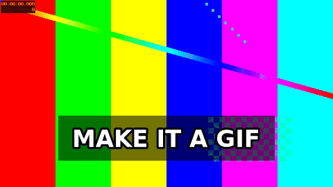

# GIF Meme Editor

A deterministic meme editor that turns an uploaded image, GIF, or short video clip into a mobile-share GIF.

This is not an AI generator. It is a small editor: pick media, add text, position it, trim video if needed, and export a GIF with FFmpeg.



## What It Does

- Search for GIFs with GIPHY or upload your own media.
- Add a quick caption or remix top/bottom meme text.
- Drag text directly on the preview before rendering.
- Trim short video sources.
- Export a shareable GIF with no audio.

## Stack

- Client: React 19 + Vite
- Server: Express + Multer
- Rendering: FFmpeg + FFprobe
- Tests: Node test runner
- Deployment: Docker web service on Render

## Run Locally

Prerequisites:

- Node.js 20+
- npm
- `ffmpeg` and `ffprobe` on PATH
- a bold font available to FFmpeg, such as DejaVu Sans Bold

Install everything:

```bash
npm run install-all
```

Start the app:

```bash
npm run dev
```

Local URLs:

- Client: `http://127.0.0.1:5173`
- API: `http://127.0.0.1:5000`

## Deploy

The app is set up to deploy as one Docker web service on Render.

Included deployment files:

- `Dockerfile`
- `render.yaml`

Render runs the Express server, serves the built React app, installs FFmpeg in the container, and uses `/api/health` as the health check.

Free-tier notes:

- Free services can spin down after idle time.
- Generated GIFs are temporary because the filesystem is ephemeral.
- For durable media storage, add object storage or a paid persistent disk.

## Environment

Useful variables:

- `PORT`
- `MAX_UPLOAD_SIZE`
- `MAX_REMOTE_HTML_SIZE`
- `ALLOW_PRIVATE_MEDIA_URLS`
- `GIPHY_API_KEY`
- `FFMPEG_BIN`
- `FFPROBE_BIN`
- `FONT_PATH`
- `VITE_API_BASE_URL`
- `VITE_API_PROXY_TARGET`

Set `GIPHY_API_KEY` if you want featured GIFs and GIF search.

Remote media imports reject private, loopback, link-local, and other non-public network addresses by default. Keep `ALLOW_PRIVATE_MEDIA_URLS` unset or `false` in production.

## API

Main endpoints:

- `GET /api/health`
- `GET /api/templates`
- `GET /api/gifs/featured`
- `GET /api/gifs/search?q=<query>`
- `POST /api/renders`

`POST /api/renders` accepts multipart form-data:

- `media` - uploaded image/video/GIF file
- `mediaUrl` - direct media URL, or a supported YouTube page URL when a direct stream is exposed
- `presetId`
- `caption`
- `topText`
- `bottomText`
- `textLayout` - optional JSON map of text slot anchors
- `startSeconds` - video only
- `durationSeconds`

The response includes the rendered GIF URL, output metadata, and render metadata.

## Validate

```bash
npm test
npm run lint
npm run build
```

## Project Shape

```text
client/                 React editor
server/
  src/
    app.js              app factory
    routes/api.js       HTTP routes
    presets/            editor profiles
    services/           FFmpeg, GIPHY, remote media, render pipeline
    validation/         request normalization
    uploads.js          multipart handling
```

## Current Non-Goals

- AI image or video generation
- full YouTube signature-decipher support
- large template marketplace
- sticker layers or multi-scene timelines
- user accounts or durable media storage
